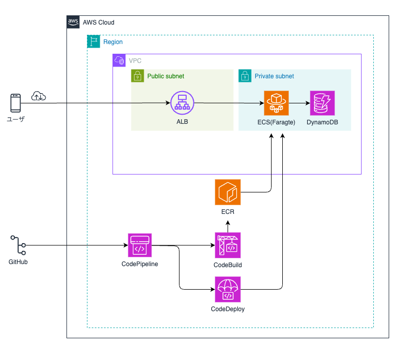

# backend-spring

このリポジトリは、Spring Boot を使用したバックエンドAPIのテンプレートです。  
「UI Labo。」のバックエンドとして、アニメ情報の提供や管理を行う想定です。

## 使用技術

- Java 17
- Spring Boot 3.x
- Maven
- RESTful API
- DynamoDB Local（ローカル開発用）
- Docker（開発環境の統一）


## 前提条件

- Java 17 以上
- Maven 3.x
- Docker（DynamoDB Local 実行用）

## プロジェクトの構成

```

backend-spring/
├── src/
│   └── main/
│       ├── java/
│       │   └── com/example/...
│       └── resources/
│           └── application.yml
├── pom.xml
└── docker-compose.yml

````

---

## DynamoDB Local を Docker で起動

```bash
docker-compose up -d
````

※ `docker-compose.yml` により、ポート `8000` で DynamoDB Local が起動します。
Spring Boot 側の接続先も `localhost:8000` にしてください。

## Spring Boot アプリの起動

```bash
mvn spring-boot:run
```

---

## APIの例

* GET `/api/anime` - アニメ情報の一覧取得
* POST `/api/anime` - 新規作成
* PUT `/api/anime/{id}` - 更新
* DELETE `/api/anime/{id}` - 削除

---

## ビルド（パッケージ作成）

```bash
mvn clean package
```

---

## 今後の予定（TODO）

* AWS DynamoDB との本番環境連携
* Spring Security 追加
* テストコードの充実（JUnit, Mockito）
* Swagger/OpenAPI の導入

---

## 補足

このプロジェクトは、「つくって試して、育てていくラボ的ポートフォリオ」の一部として運用しています。
実験的な実装や一時的なコードも含まれることがあります。

## インフラアーキテクチャ図

以下は本システムのインフラ構成図です。
このシステムは AWS ECS (Fargate) を中心としたマイクロサービス構成で構築されています。CI/CD には GitHub と AWS CodePipeline を連携し、DynamoDB を利用したサーバレスな構成となっています。


